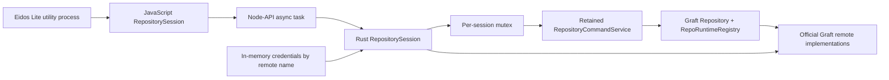

# Resident SDK architecture

## Decision

Graft now has an embeddable repository-session boundary in addition to its CLI boundary. The
minimum slice consists of:

- `RepositoryCommandService` in `graft-sqlite`, made public and reusable while preserving the
  existing one-shot CLI helper;
- `graft-sdk`, a Rust session/lifecycle crate that owns one retained service and explicit
  credentials;
- `graft-sdk-node`, an ABI-stable Node-API 8 native class whose work runs off the JavaScript main
  thread;
- `@eidos.space/graft`, the public JavaScript/TypeScript contract and native package loader.

This is analogous to `libgit2 → Graft Rust session core` and
`NodeGit → ABI-stable Node-API addon`. The analogy explains the repository-handle lifecycle; those
projects are not dependencies. The implementation neither copies Git protocol logic nor creates a
second Graft repository implementation.

## Data flow

`RepositoryCommandService::open_with_credentials` performs `setup_graft_temporary` and creates the
runtime registry once. Subsequent commands use the retained service instead of repeating that
setup. The CLI continues calling `execute_repository_command`, which opens a service for one
command and therefore preserves existing behavior.

All commands still use the official repository pragmas and JSON output functions. This keeps
repository rules, conflict behavior, worktree materialization, and FS/S3/HTTP remote protocols in
one implementation.

## Concurrency invariant

The Rust session holds its `RepositoryCommandService` in a mutex for the complete command. The
Node-API class owns the session through `Arc`, so async tasks may safely outlive the originating
JavaScript stack frame.

- same session: serialized;
- separate sessions for different repository paths: independent and parallelizable;
- separate sessions for the same repository: the storage lock rejects the second with
  `GRAFT_SDK_REPOSITORY_BUSY`.

There is intentionally no global SDK mutex. Eidos should keep a registry keyed by canonical Space
identity and enforce one live session for each Space.

## Lifecycle state machine

```mermaid
stateDiagram-v2
    [*] --> Closed
    Closed --> Opening: open
    Opening --> Open: runtime retained
    Opening --> Closed: open failure / concurrent close
    Open --> Closing: close or reopen
    Closing --> Closed: in-flight command completes; runtime dropped
    Closing --> Opening: reopen
    Opening --> Open: runtime reconstructed
```

`close` publishes `Closing` before waiting for the session mutex. A call already holding the mutex
finishes. A queued operation sees `Closing` after it acquires the worker and fails without entering
Graft. The native finalizer drops the last `Arc`, but explicit `close` is the supported orderly
shutdown path.

A utility-process crash releases the OS-backed storage lock. A new session reopens from durable
state; there is no daemon lease, socket, stdin stream, or PID registry to recover.

## Worktree and application database handles

Only `restore`, `restorePaths`, `pull`, and `cloneRepository` can replace tracked physical
worktree files. Eidos must close affected application SQLite handles before these calls and reopen
them afterward.
`init` writes `.graft`, while `fetch`, `push`, and remote configuration change only repository or
remote state.

`status`, `diff`, and history are non-materializing and are supported while an application
`DatabaseSync` handle is open. `addAll` also does not replace a worktree file, but consumers should
checkpoint application WAL state first when creating a deterministic snapshot.

## Credential policy

`RemoteCredentials::explicit` is the SDK policy. Clones share an in-memory map keyed by repository
remote name, enabling rotation without reopening the session. Repository discovery, init, clone,
and ordinary remote operations attach the same credential context before constructing the
existing `HttpRemote`.

Tokens are:

- passed only to the HTTP request's bearer-auth header;
- absent from repository config and remote URLs;
- held in zeroizing allocations;
- redacted from repository/HTTP errors before crossing the SDK boundary.

HTTP URL userinfo, queries, and fragments are rejected by SDK validation. The SDK never falls back
to process environment credentials. `RemoteCredentials::environment` remains only for the CLI and
legacy direct-repository entry points.

## Cancellation and conflicts

The binding uses Node-API async work with an optional `AbortSignal`. Node cancels queued tasks; an
abort after start also flips a shared cooperative token. Repository status, diff, history, stage,
restore, inventory, tree hydration, and SQLite page loops check that token and return a dedicated
cancelled error, which the JavaScript wrapper normalizes to `AbortError`. The retained runtime stays
valid for the next call. Multi-path mutations may complete a prefix, but each index write and
individual worktree replacement remains valid and observable through the next status.

Graft's existing JSON command outcomes remain the source of truth for merge/pull/restore conflicts.
The binding adds stable lifecycle, invalid-argument, repository-busy, repository-command, and
invalid-response error codes without translating repository protocol semantics.

## Packaging boundary

Node-API 8 provides runtime ABI stability, while native packages still select by operating system,
CPU, and Linux libc. `@eidos.space/graft` is a small root package with exact-version optional
dependencies for macOS arm64/x64, Linux glibc arm64/x64, and Windows x64. Each optional package
contains exactly one binary and declares npm host constraints. There is no install script, native
compilation, or binary download on the consumer machine.

Electron loads the SDK only in a utility process and must leave the selected `.node` file outside
ASAR, or include `*.node` in `asarUnpack`. The Rust crates remain private implementation details;
the npm contract is the supported Node/Electron integration surface.

SDK releases use independent `graft-sdk-vX.Y.Z` annotated tags, while CLI/SQLite releases continue
to use `vX.Y.Z`. Both tag types must point to commits reachable from `main`.
